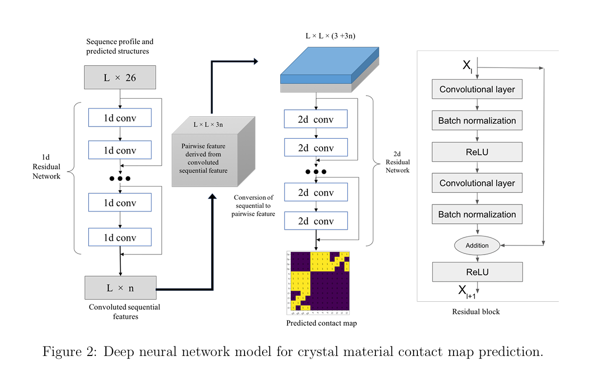
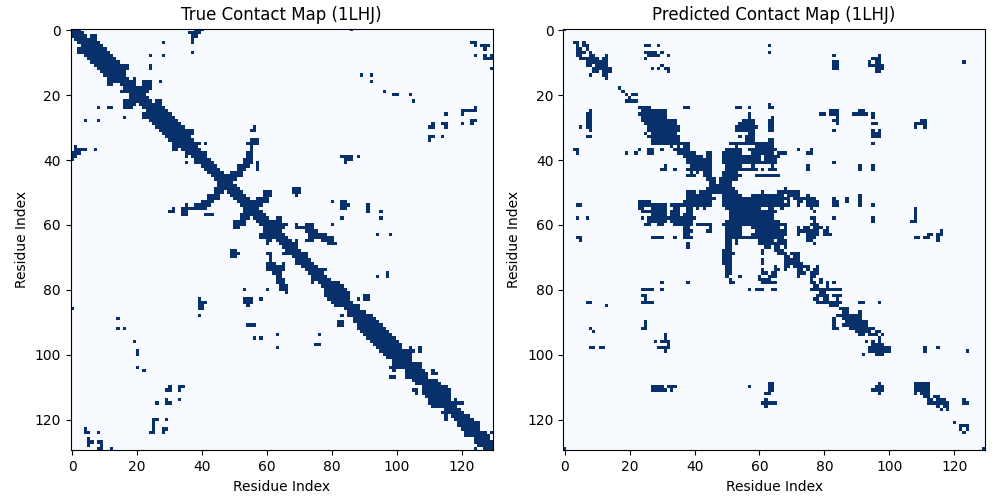
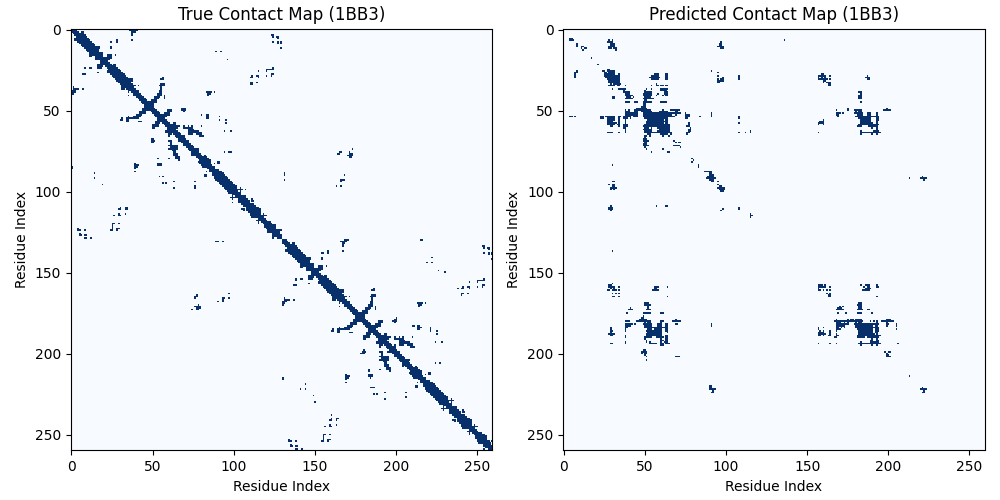

# Residue-Residue Contact Map Prediction

## 📌 Project Overview
This project aims to predict residue-residue contact maps using 
ESM2 embeddings and sequences from .pdb database. 
We integrate Multiple Sequence Alignment (MSA)
to capture evolutionary relationships for improved contact map predictions.
This project is just some challenge for me to understand the topic. The project was done in 1 week.
---

## 💡 Key Insights & Approach 

### 1️⃣ Initial Considerations

#### My steps
- Extracted sequences from .pdb files.
- Initially planned to use similar sequences and their contact maps but found length variation problematic.
- After some research, I found that MSA (Multiple Sequence Alignment) is usually a good approach for such problems.

### 2️⃣ Handling MSA

#### My steps
- I started by finding MSA tools and getting the aligned sequences. This required some initial setup.
- In current solution I use [BLAST](https://en.wikipedia.org/wiki/BLAST_(biotechnology)) with [ClustalOmega](https://github.com/GSLBiotech/clustal-omega), because it was faster.
Initially was trying [HH-suite](https://github.com/soedinglab/hh-suite), already compiled and tried to create db, but it took a lot of time, so used **BLAST**.
- Tried to align all sequences together, but Aligned sequences were too long (~40,000 residues).  This was computationally expensive, so I realized I only needed to use smaller set of sequences` similar sequences.
- Found that Direct Coupling Analysis (DCA) of MSA contains valuable evolutionary information. I attempted to use different DCA models, the fastest one was [GREMLIN](https://github.com/sokrypton/GREMLIN_CPP) for DCA extraction but found it took a lot of time (~8 seconds per MSA).
- Other than that it is also good to analyze the inverse of covariance matrix, and it's eigenvalues and eigenvectors.

### 3️⃣ Leveraging MSA Transformer

#### My steps
- I discovered an MSA transformer that creates embeddings for MSAs.
- MSA Transformer limited sequence length to 1024, so chunked sequences with 30% overlap.
- After computed msa embeddings for each chunk and merged them together by averaging the overlapping section.
- Extracted ESM2 embeddings ((seq_length, 1280)) and MSA embeddings ((num_seq, aligned_seq_length, 768)).
- Averaged MSA sequences to obtain (aligned_seq_length, 768) embeddings.

### 4️⃣ Combining Embeddings for Prediction

#### My steps
- Used the aligned sequence of the original sequence to create mask for padding.
- Padded ESM2 embeddings to match aligned sequence length ((aligned_seq_length, 1280)).
- Stacked ESM2 & MSA embeddings → (aligned_seq_length, 2048).
- Applied learnable matrix (W) transformation: A * W * A^T + Relu activation.
- Used a Residual block (CNN to capture local features) + Sigmoid activation for final output.


### 5️⃣ Loss Function
- Applied Binary Cross Entropy Loss with weights(because there were a lot more 0 then 1) for classification.

### 📜 Reference Paper
This approach aligns with research in [this paper](https://arxiv.org/pdf/2102.01620).

### ⌛️ Overall time spent (35-36hr + 2hr for README and reformatting)


## 🧩 Model Architecture

### 🔹 Inspired by the Paper
- The architecture is based on the second block of the referenced paper.
- Instead of the first block, ESM2 & MSA Transformer features are directly used.



---

## 🛠 Installation

### 📥 Setup Environment
```sh
conda create -n deeporigin python=3.11 anaconda
conda activate deeporigin
pip install -r requirements.txt
```

## 📂 Data Preparation

### 1️⃣ Generate FASTA Files
```sh
python create_fasta.py train
python create_fasta.py test
```
### 2️⃣ Compute Contact & Distance Maps
Here I also computed distance maps for some experiments,
but in the final solution we only need contact maps.
```sh
python get_contact_maps.py train
python get_contact_maps.py test
```
### 3️⃣ Generate ESM2 Embeddings
```sh
python get_esm_embeddings.py train
python get_esm_embeddings.py test
```
### 4️⃣ Create MSA for Each Sequence

#### 🔧 Install Dependencies
```sh
sudo apt install clustalo  # Install Clustal Omega
conda install -c bioconda blast  # Install BLAST
```
#### 🛠 Run MSA Alignment
```sh
python create_msa.py train
python create_msa.py test
```
⚠️ Takes ~8 hours for 20 similar sequences, so one might take only 5 sequences.
But I heard that people usually use more than 100. But our dataset is not that large, so 20 is fine. 

### 5️⃣ Extract MSA Embeddings
```sh
python get_msa_embeddings.py --mode train
python get_msa_embeddings.py --mode test
```

---

## 🚀 Training the Model
Now we can train model. Make sure all parameters are set in the **.env** file
```sh
python train.py
```

---

## 📊 Model Evaluation

- Metric: ACC, Precision, Recall, F1, MCC 
- Unfortunately didn't have time to train model, so didn't evaluate it,
but have a script for it, and it is tested.
- Might also try the evaluation presented in this [colab](https://colab.research.google.com/github/facebookresearch/esm/blob/main/examples/contact_prediction.ipynb#scrollTo=c7T9xWTXeIaR) from msa transformer

Run Evaluation:
```sh
python evaluate.py
```
here is some example of image from test set, after training only on first 90 samples of the train set(out of 15000).


So it was able to capture patterns even training on 90 samples of train set


## ⌛️ Things that I didn't test, but wanted to

- 🤔 So as I mentioned` **DCA** and **Covariance Matrix** have interesting information, that would probably be valuable for contact map prediction.
- 🤔 The motivation of using DCA and covariance matrix information without **MSA** transformer embeddings, is the sequence length restriction of **MSA** transformer (1024 max).
I didn't like the fact that I need to chunk and compute **MSA** transformer embeddings for chunks and then recombine them.
- 🤔 I also considered precomputing A * A^T for all concatenated embeddings **(seq_length, 2048) → (seq_length, seq_length)** and storing the results, allowing
for more efficient retrieval during training. That way I believe, we could get good results, and it  would be faster to train.
so I could train it on the whole dataset (also considering to add more residual CNN blocks for this).

## 📌 Summary

- ✅ Getting **ESM2** and **MSA** transformer embeddings.
- ✅ CNN-based network which uses **ESM2** and **MSA** transformer embeddings to capture local features
- ✅ Prepared colab notebook to demonstrate the solution [Notebook](notebooks/Training.ipynb)
- ❌ Didn't manage to train and evaluate model on the whole database because of lack of resources.